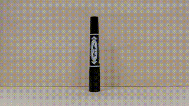

# 円運動・単振動
2020年度　物理研究　長倉クラス  
１月~　  
  

[授業資料はこちら](https://github.com/phys-ken/2020buturikenkyu_slides)

---

## ふりこと張力

<iframe width="560" height="315" src="https://www.youtube.com/embed/7irV-3jMXBM" frameborder="0" allow="accelerometer; autoplay; clipboard-write; encrypted-media; gyroscope; picture-in-picture" allowfullscreen></iframe>

---

## まずは動画を見てください。

<video controls="" src = "fig/1x.mov" width = 400>
このブラウザでは動画はサポートされていません。Google Chrome等でご覧ください。</video>

---

## 今日の課題

* 物体にはどんな力がはたらいていますか？
* どんな例が考えられますか？
  

---

## 例１

<video controls="" src = "fig/2syamen.mov" width = 400>
このブラウザでは動画はサポートされていません。Google Chrome等でご覧ください。</video>

---

## 例2

<video controls="" src = "fig/3kaze.mov" width = 400>
このブラウザでは動画はサポートされていません。Google Chrome等でご覧ください。</video>

---

## 例3

<video controls="" src = "fig/4kasoku.mov" width = 400>
このブラウザでは動画はサポートされていません。Google Chrome等でご覧ください。</video>

---

## 例4

<video controls="" src = "fig/5gensoku.mov" width = 400>
このブラウザでは動画はサポートされていません。Google Chrome等でご覧ください。</video>

---

### 例3を丁寧に考えよう。

--

---

### 具体例

ローカル１  
ローカル２