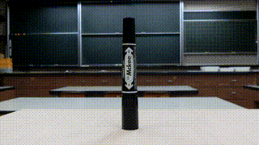
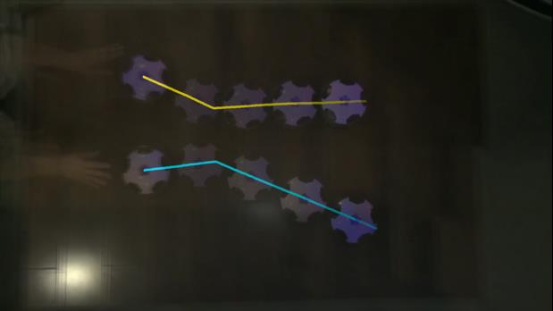
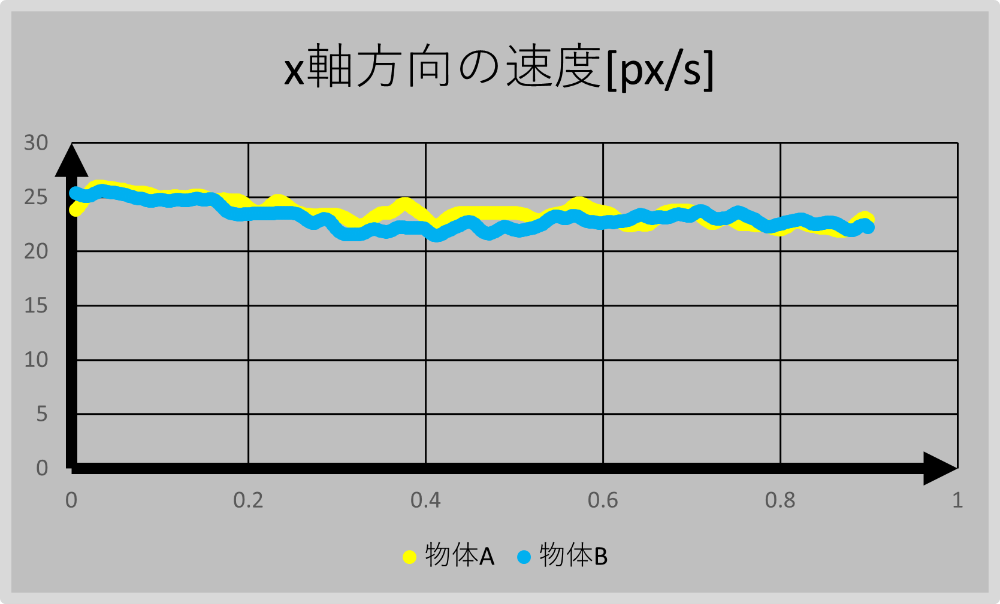

# 円運動・単振動
2020年度　物理研究　長倉クラス  
１月~　  
  

[授業資料はこちら](https://github.com/phys-ken/2020buturikenkyu_slides)

---

## ふりこと張力

<iframe width="560" height="315" src="https://www.youtube.com/embed/7irV-3jMXBM" frameborder="0" allow="accelerometer; autoplay; clipboard-write; encrypted-media; gyroscope; picture-in-picture" allowfullscreen></iframe>

---

## まずは動画を見てください。

<video controls="" src = "fig/1x.mov" width = 400>
このブラウザでは動画はサポートされていません。Google Chrome等でご覧ください。</video>

---

## 今日の課題

* 物体にはどんな力がはたらいていますか？
* どんな例が考えられますか？
  

---

## 例１

<video controls="" src = "fig/2syamen.mov" width = 400>
このブラウザでは動画はサポートされていません。Google Chrome等でご覧ください。</video>

---

## 例2

<video controls="" src = "fig/3kaze.mov" width = 400>
このブラウザでは動画はサポートされていません。Google Chrome等でご覧ください。</video>

---

## 例3

<video controls="" src = "fig/4kasoku.mov" width = 400>
このブラウザでは動画はサポートされていません。Google Chrome等でご覧ください。</video>

---

## 例4

<video controls="" src = "fig/5gensoku.mov" width = 400>
このブラウザでは動画はサポートされていません。Google Chrome等でご覧ください。</video>

---

### 例3を丁寧に考えよう。

--

---

### 具体例

[電車](https://www.nhk.or.jp/kokokoza/tv/basicscience/archive/chapter023.html)  

---

<iframe width="560" height="315" src="https://www.youtube.com/embed/aJlcbzDhaaY" frameborder="0" allow="accelerometer; autoplay; clipboard-write; encrypted-media; gyroscope; picture-in-picture" allowfullscreen></iframe>

---

## 遠心力

---

### 実はもう一つ

<video controls="" src = "fig/6ensin.mov" width = 400>
このブラウザでは動画はサポートされていません。Google Chrome等でご覧ください。</video>

---

<video controls="" src = "fig/7ensin.MOV" width = 400>
このブラウザでは動画はサポートされていません。Google Chrome等でご覧ください。</video>

---

## 遠心力を元に考えると…

<iframe width="560" height="315" src="https://www.youtube.com/embed/UDMGfMZjYYc" frameborder="0" allow="accelerometer; autoplay; clipboard-write; encrypted-media; gyroscope; picture-in-picture" allowfullscreen></iframe>

---

## チョン押し

<iframe width="560" height="315" src="https://www.youtube-nocookie.com/embed/tfy5O6SmMCY" frameborder="0" allow="accelerometer; autoplay; clipboard-write; encrypted-media; gyroscope; picture-in-picture" allowfullscreen></iframe>

---

## 平面での衝突

[動画](https://www.youtube.com/watch?v=IpGUibvlSUE&feature=youtu.be)  
[軌跡](https://www.youtube.com/watch?v=UD6FcBrEHSc&feature=youtu.be)  
[ストロボ映像](https://phys-ken.github.io/2020buturikenkyu_slides/stFig/2D_Mom.html)

---

## 運動のグラフ(x方向)

---

## 運動のグラフ(y方向)

